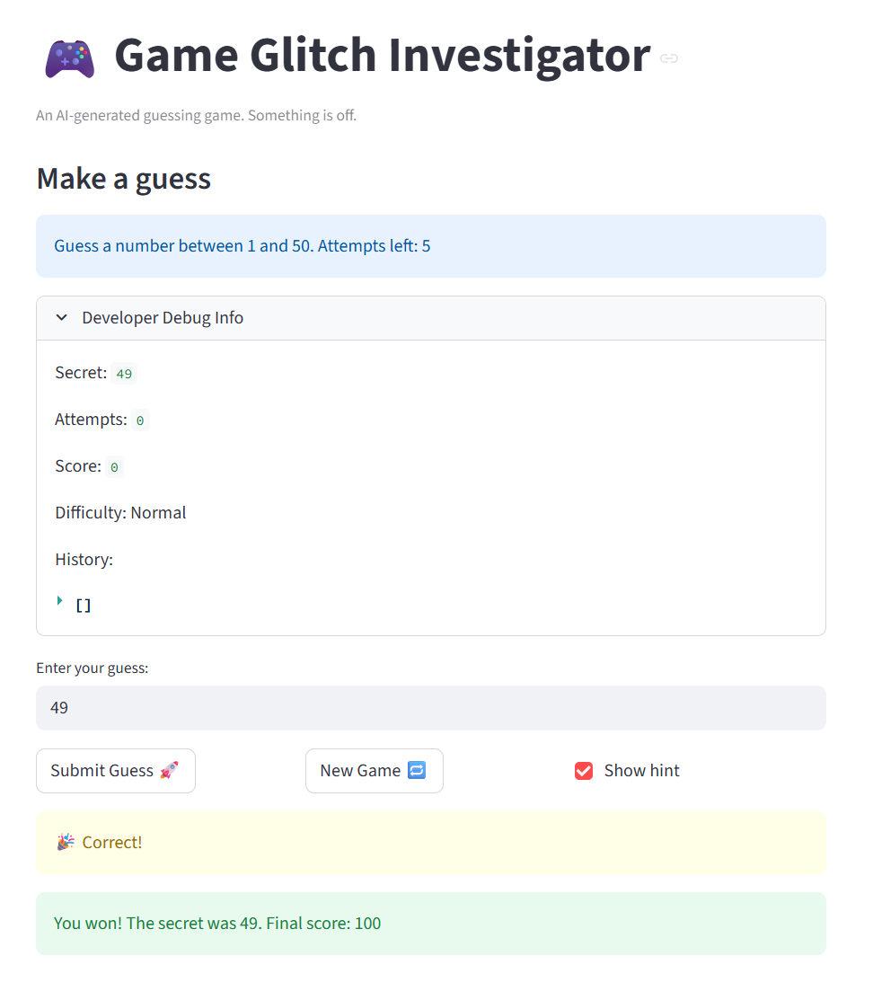

# 🎮 Game Glitch Investigator: The Impossible Guesser

## 🚨 The Situation

You asked an AI to build a simple "Number Guessing Game" using Streamlit.
It wrote the code, ran away, and now the game is unplayable. 

- You can't win.
- The hints lie to you.
- The secret number seems to have commitment issues.

## 🛠️ Setup

1. Install dependencies: `pip install -r requirements.txt`
2. Run the broken app: `python -m streamlit run app.py`

## 🕵️‍♂️ Your Mission

1. **Play the game.** Open the "Developer Debug Info" tab in the app to see the secret number. Try to win.
2. **Find the State Bug.** Why does the secret number change every time you click "Submit"? Ask ChatGPT: *"How do I keep a variable from resetting in Streamlit when I click a button?"*
3. **Fix the Logic.** The hints ("Higher/Lower") are wrong. Fix them.
4. **Refactor & Test.** - Move the logic into `logic_utils.py`.
   - Run `pytest` in your terminal.
   - Keep fixing until all tests pass!

## 📝 Document Your Experience

- [x] Describe the game's purpose.
   - This game's purpose is to have the user guess the secret number within a certain range, depending on chosen difficulty. The code is AI generated, and has some bugs that are meant to be identified and fixed.
- [x] Detail which bugs you found.
   - Some bugs I found included:
      1. Hint logic being backwards
      2. "New Game" button not resetting the game state
      3. The displayed number of attempts being incorrect
      4. The user having one less attempt than described
      5. Inconsistent logic for checking guesses
- [x] Explain what fixes you applied.
   - Some fixes I applied included
      1. Using Copilot and Claude to refactor logic functions into a separate file
      2. Creating test cases to test effectiveness of refactored functions
      3. Restructuring some of the program so that rerenders are done at appropriate times

## 📸 Demo

- [x] [Insert a screenshot of your fixed, winning game here]

## 🚀 Stretch Features

- [ ] [If you choose to complete Challenge 4, insert a screenshot of your Enhanced Game UI here]
